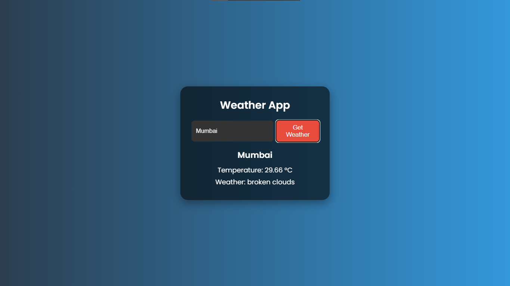

# 🌤️ Weather App

A simple and responsive Weather App that allows users to get current weather information for any city using the **OpenWeatherMap API**. Built with **HTML, CSS, and JavaScript**.

---

## 🚀 Features

- 🌍 Search weather by city name
- 🌡️ Displays temperature and weather condition
- 🎨 Clean and responsive dark-themed UI
- 🔄 Real-time data from OpenWeatherMap API
- ⏳ Loading animation while fetching data
- ❌ Error message for invalid city names

---

## 📸 Preview



---

## 🛠️ Technologies Used

- HTML5
- CSS3
- JavaScript (Vanilla)
- OpenWeatherMap API

---

## 🧠 How It Works

1. User enters a city name in the input box.
2. On clicking the "Get Weather" button, a request is sent to the OpenWeatherMap API.
3. The API returns current weather data in JSON format.
4. JavaScript parses this data and displays:
   - City name
   - Temperature
   - Weather description
   - Weather icon (optional)
5. If the city is not found, an error message is shown.

---

## 📦 Setup Instructions

1. **Clone the repository** 
   ```bash
   git clone https://github.com/Kaveri-0911/weatherApp.git
   cd weather-app
   ```
   Get an API key from https://openweathermap.org/api
   Insert your API key in weather.js:
   ```javascript
   const API_KEY = "217b50ae77b5c5d77af3e09e0da2e448";
   ```

   Open index.html in your browser to run the app.

📁 Project Structure
```markdown
weather-app/
├── index.html
├── weather.css
├── weather.js
├── README.md
└── screenshot.png 
```

🔐 API Key Note
The OpenWeatherMap API key is exposed in the frontend. For production apps, it's recommended to use a backend to keep it secure.

📌 Future Improvements
- Add humidity, wind speed, and pressure
- Show 5-day weather forecast
- Add search history
- Deploy to GitHub Pages or Netlify

👩‍💻 Author
Kaveri Kailas Jadhav


---
